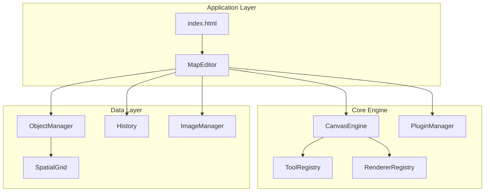
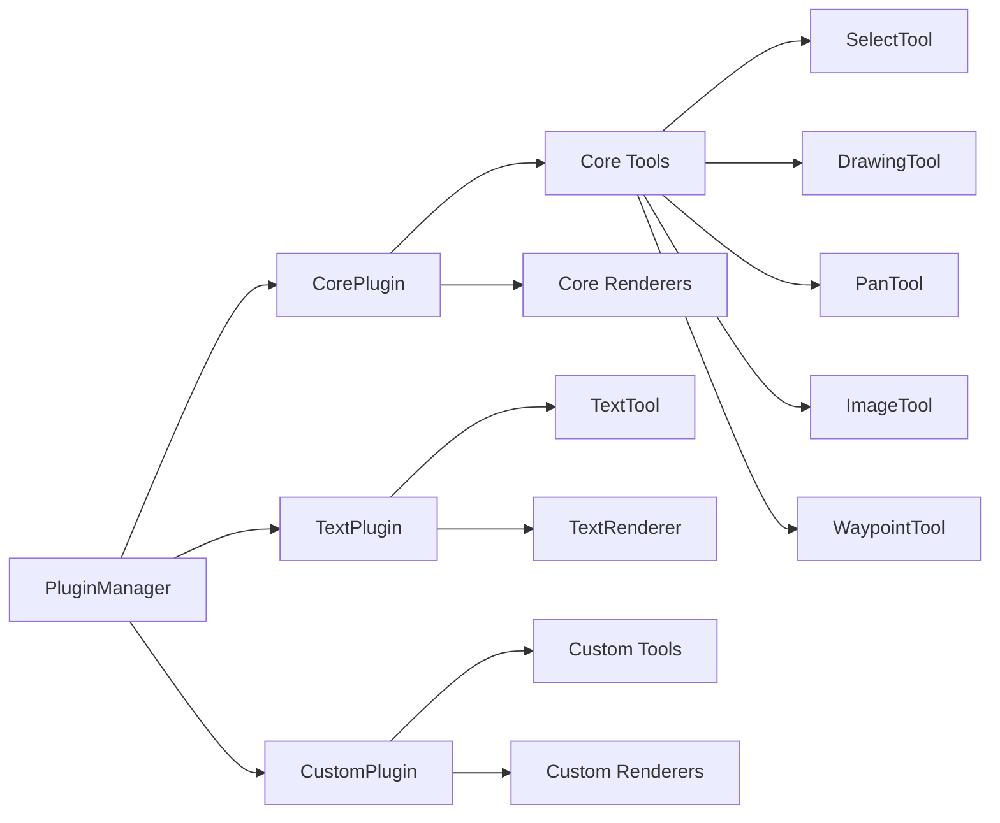
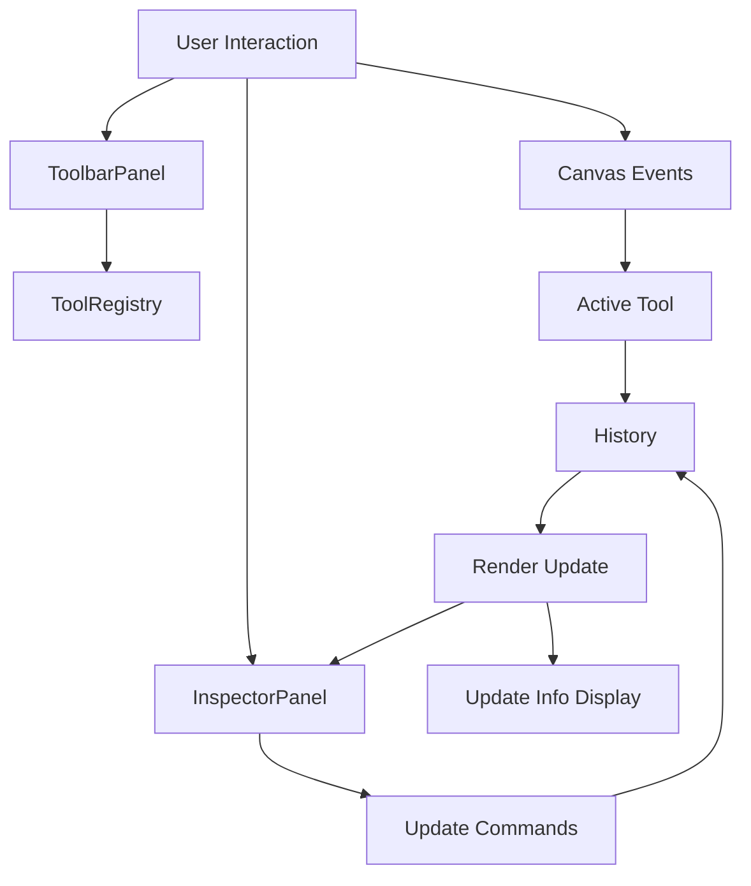
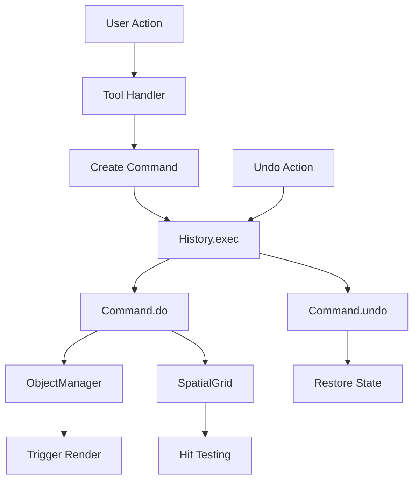
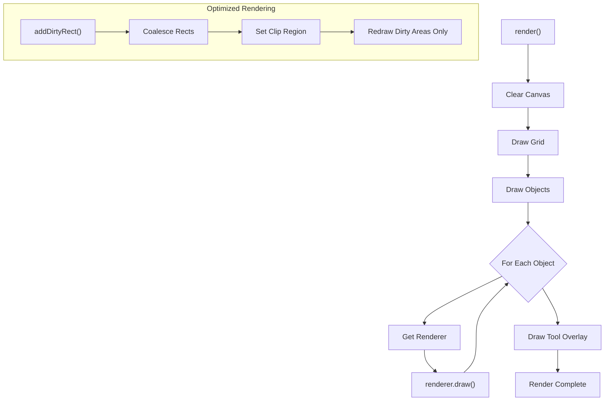
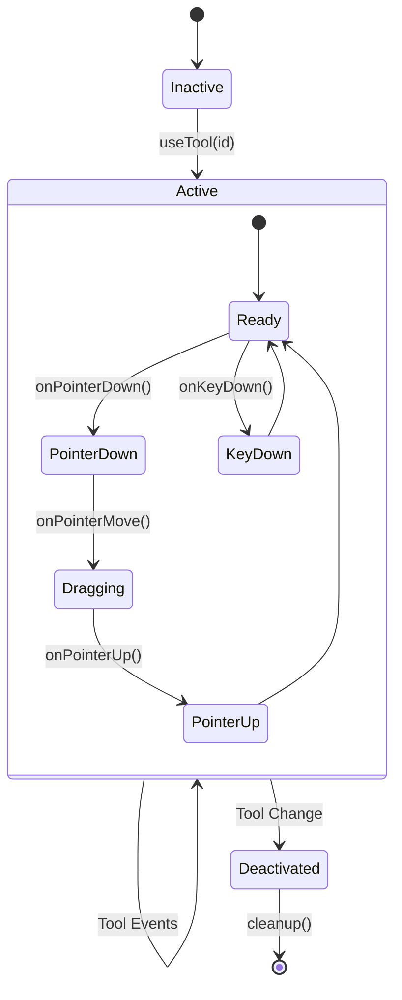
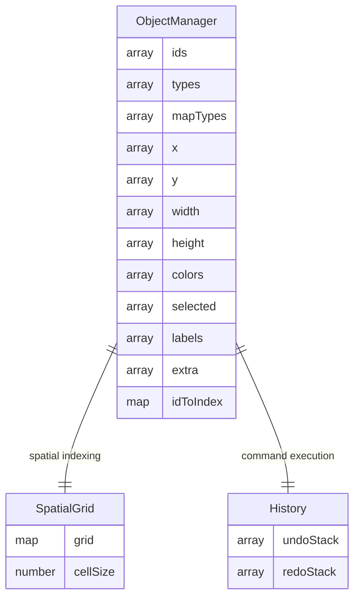

# Ketchup 

A lightweight map editor and drawing engine starter kit for web applications. Ketchup provides a robust canvas system with drag-and-drop support for creating interactive maps with walls, corridors, waypoints, warppoints, and more. Includes essential features such as undo/redo, object rotation, JSON import/export, and image saving.

## Features

- **Canvas-based Drawing Engine** - High-performance rendering with spatial optimization
- **Shape Tools** - Rectangle, circle, text, and image support
- **Map Editor** - Specialized tools for creating walls, corridors, rooms, waypoints, and warppoints
- **Undo/Redo System** - Full command pattern implementation with merge support
- **Import/Export** - JSON serialization and image export capabilities
- **Plugin Architecture** - Extensible system for adding custom tools and renderers
- **Spatial Grid** - Efficient hit-testing and collision detection
- **Multi-selection** - Advanced selection system with clipboard operations
- **Real-time Collaboration Ready** - Clean separation of concerns for easy integration

## Demo

🔗 **Live Demo**: [https://jedsadha1777.github.io/ketchup/](https://jedsadha1777.github.io/ketchup/)  

🔗 **Map Demo**: [https://jedsadha1777.github.io/ketchup/demo-map.html](https://jedsadha1777.github.io/ketchup/)  

🔗 **Prod Demo**: [https://jedsadha1777.github.io/ketchup/demo-prod.html](https://jedsadha1777.github.io/ketchup/demo-prod.html)  

## Installation

```bash
git clone https://github.com/Jedsadha1777/Ketchup.git
cd Ketchup
# Open index.html in a web server
```

## Quick Start

```javascript
import { MapEditor } from './map-editor/MapEditor.js';

const canvas = document.getElementById('canvas');
const editor = new MapEditor(canvas);
```

## Architecture

### Core System Overview



### Plugin System Architecture



### UI Components Flow



### Data Flow & Command Pattern



### Rendering Pipeline



### Tool Lifecycle



### Object Management Structure



## Plugin Development

Ketchup uses a modular plugin architecture that allows you to extend functionality easily.

### Creating a Custom Plugin

```javascript
import { IPlugin } from '../types/IPlugin.js';
import { CustomTool } from './CustomTool.js';
import { CustomRenderer } from './CustomRenderer.js';

export default class CustomPlugin extends IPlugin {
    constructor(editor, options = {}) {
        super(editor, options);
        
        this.id = 'custom';
        this.name = 'Custom Plugin';
        this.version = '1.0.0';
        this.description = 'My custom functionality';
        this.author = 'Your Name';

        this.setupComponents();
    }

    setupComponents() {
        this.tools = [
            new CustomTool()
        ];

        this.renderers = [
            new CustomRenderer()
        ];
    }

    async init() {
        this.log('Custom plugin initialized');
        
        // Plugin initialization logic
        this.editor.on('objectSelected', this.handleObjectSelected.bind(this));
    }

    async cleanup() {
        this.log('Custom plugin cleaned up');
        
        // Cleanup logic
        this.editor.off('objectSelected', this.handleObjectSelected);
    }

    handleObjectSelected(data) {
        // Custom object selection handling
        console.log('Object selected:', data);
    }
}
```

### Creating a Custom Tool

```javascript
import { ITool } from '../types/ITool.js';

export class CustomTool extends ITool {
    constructor() {
        super('custom', 'Custom Tool', { 
            icon: '🔧',
            cursor: 'crosshair'
        });
    }

    activate(ctx) {
        ctx.updateCursor(this.cursor);
    }

    onPointerDown(e, pos, ctx) {
        // Handle mouse down events
        console.log('Pointer down at:', pos);
    }

    onPointerMove(e, pos, ctx) {
        // Handle mouse move events
    }

    onPointerUp(e, pos, ctx) {
        // Handle mouse up events
    }

    onKeyDown(e, ctx) {
        // Handle keyboard events
        if (e.key === 'Escape') {
            // Custom escape handling
            return true; // Event handled
        }
        return false; // Event not handled
    }

    drawOverlay(ctx) {
        // Custom overlay rendering
        ctx.ctx.strokeStyle = '#ff0000';
        ctx.ctx.strokeRect(10, 10, 100, 100);
    }
}
```

### Creating a Custom Renderer

```javascript
import { ObjectRenderer } from '../types/ObjectRenderer.js';

export class CustomRenderer extends ObjectRenderer {
    canRender(obj) {
        return obj.type === 'custom-shape';
    }

    getAvailableProperties(obj) {
        return ['color', 'label', 'customProperty'];
    }
    
    draw(obj, ctx, view) {
        ctx.fillStyle = obj.color;
        ctx.strokeStyle = '#333';
        ctx.lineWidth = 1 / view.zoom;
        
        // Custom drawing logic
        ctx.beginPath();
        ctx.arc(obj.x + obj.width/2, obj.y + obj.height/2, 
                Math.min(obj.width, obj.height)/2, 0, Math.PI * 2);
        ctx.fill();
        ctx.stroke();
        
        this.drawSelection(obj, ctx, view);
    }
    
    contains(obj, px, py) {
        // Custom hit testing
        const centerX = obj.x + obj.width / 2;
        const centerY = obj.y + obj.height / 2;
        const radius = Math.min(obj.width, obj.height) / 2;
        const distance = Math.sqrt((px - centerX) ** 2 + (py - centerY) ** 2);
        return distance <= radius;
    }
}
```

### Loading Plugins

```javascript
// In MapEditor.js
async setupPlugins() {
    await this.pluginManager.loadPlugin('../plugins/CorePlugin.js');
    await this.pluginManager.loadPlugin('../plugins/TextPlugin.js');
    await this.pluginManager.loadPlugin('../plugins/CustomPlugin.js');
}
```

## State Management & Architecture

### Object Manager Pattern
Ketchup uses a flat array structure for optimal performance:

```javascript
// Arrays for different object properties
this.ids = [];          // Unique identifiers
this.types = [];        // Object types
this.x = [];           // X coordinates
this.y = [];           // Y coordinates
this.selected = [];    // Selection states
```

### Command Pattern
All modifications use the command pattern for undo/redo:

```javascript
const cmd = new CreateObjectCmd(objects, spatialGrid, 'rectangle', x, y, w, h, color);
const result = history.exec(cmd);
```

### Event System
Clean event-driven architecture:

```javascript
editor.on('objectSelected', (data) => {
    console.log('Selection changed:', data);
});

editor.emit('customEvent', { data: 'value' });
```

## Performance Optimization

### Spatial Grid System
Efficient hit-testing using spatial partitioning:

```javascript
// Objects are indexed by grid cells
const candidateIds = spatialGrid.getObjectsAt(x, y);
```

### Dirty Rectangle Rendering
Optimized rendering with dirty regions:

```javascript
// Mark areas that need redrawing
editor.addDirtyRect(bounds);
editor.optimizedRender(); // Only redraws dirty areas
```

### Device Pixel Ratio Support
High-DPI display optimization:

```javascript
// Automatic DPR scaling
ctx.setTransform(dpr, 0, 0, dpr, 0, 0);
```

## Complex UI Integration

### Inspector Panel System
Dynamic property editing based on object type:

```javascript
// Renderers define available properties
getAvailableProperties(obj) {
    return ['color', 'label', 'fontSize', 'textAlign'];
}
```

### Multi-Selection Support
Advanced selection system with bulk operations:

```javascript
// Multi-object operations
const selectedIndices = objects.getSelectedIndices();
clipboardOps.copy(); // Copies all selected objects
```

### Context Menu Integration
Right-click context menus with object-specific actions:

```javascript
// Object ordering operations
objectOrderOps.moveToFront(index);
objectOrderOps.moveBackward(index);
```

## Extensibility

### Plugin Hook System
Plugins can hook into editor lifecycle:

```javascript
// Plugin lifecycle hooks
async init() { /* Initialize plugin */ }
async cleanup() { /* Cleanup plugin */ }
onToolChange(toolId) { /* Handle tool changes */ }
```

### Custom Property Types
Support for complex object properties:

```javascript
// Text objects with rich properties
extra: {
    fontSize: 16,
    fontFamily: 'Arial',
    textAlign: 'center',
    lineHeight: 1.2
}
```

### Renderer Priority System
Control rendering order with renderer registration:

```javascript
// More specific renderers first
this.renderers = [
    new WaypointRenderer(),    // Most specific
    new MapObjectRenderer(),
    new ImageRenderer(),
    new CircleRenderer(),
    new RectangleRenderer()    // Most general
];
```

## API Reference

### Core Classes

- **MapEditor** - Main editor class
- **CanvasEngine** - Base canvas functionality
- **ObjectManager** - Object storage and manipulation
- **ToolRegistry** - Tool management
- **RendererRegistry** - Renderer management
- **History** - Undo/redo system
- **SpatialGrid** - Spatial indexing

### Built-in Tools

- **SelectTool** - Object selection and manipulation
- **DrawingTool** - Shape creation (rectangles, circles)
- **TextTool** - Text editing with live preview
- **ImageTool** - Image insertion and management
- **PanTool** - Canvas panning
- **WaypointTool** - Map waypoint creation

### Operations

- **ClipboardOperations** - Copy/paste/duplicate
- **FileOperations** - JSON import/export
- **ImageExportOperations** - PNG/JPEG/WebP export
- **ObjectOrderOperations** - Z-order management

## Contributing

1. Fork the repository
2. Create a feature branch
3. Make your changes following the existing patterns
4. Test your changes
5. Submit a pull request

## License

MIT License - see LICENSE file for details.

## Support

For questions and support, please open an issue on the [GitHub repository](https://github.com/Jedsadha1777/Ketchup).